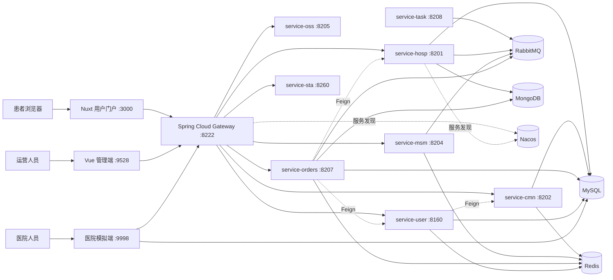

# 系统架构

## 总体结构

## 服务职责

| 服务 | 端口 | 主要职责 | 主要存储/依赖 |
| --- | ---: | --- | --- |
| `service-gateway` | 8222 | 统一入口、跨域、按 `/hosp`、`/cmn`、`/user`、`/msm`、`/oss`、`/order`、`/statistics` 路由 | Nacos |
| `service-hosp` | 8201 | 医院设置、医院/科室/排班数据、医院平台接口 | `yygh_hosp`、MongoDB、RabbitMQ |
| `service-cmn` | 8202 | 行政区划与通用字典、Excel 导入导出 | `yygh_cmn`、Redis |
| `service-msm` | 8204 | 验证码与短信消息消费 | Redis、RabbitMQ、短信供应商 |
| `service-oss` | 8205 | 文件上传 | 阿里云 OSS |
| `service-orders` | 8207 | 预约下单、订单查询/取消、支付与退款 | `yygh_order`、MongoDB、Redis、RabbitMQ、微信支付、Sentinel |
| `service-task` | 8208 | 定时任务与预约状态消息 | RabbitMQ |
| `service-sta` | 8260 | 预约统计 | Feign 调用订单服务 |
| `service-user` | 8160 | 登录、实名、用户与就诊人 | `yygh_user`、Redis、微信开放平台 |

## 数据边界

- MySQL 保存配置、字典、用户、就诊人、订单、支付和退款等关系数据。
- MongoDB 保存医院、科室和排班等文档数据；这部分没有出现在 MySQL 数据字典中。
- Redis 保存验证码和热点缓存；RabbitMQ 负责预约与短信等异步消息。
- 医院模拟端使用独立的 `yygh_manage` 数据库，不与平台业务服务共用表。
- 服务间调用通过 OpenFeign；外部流量应统一经过网关，`/inner/` 路由不得直接暴露到公网。
